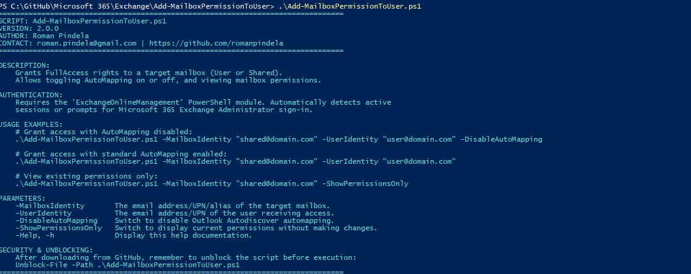
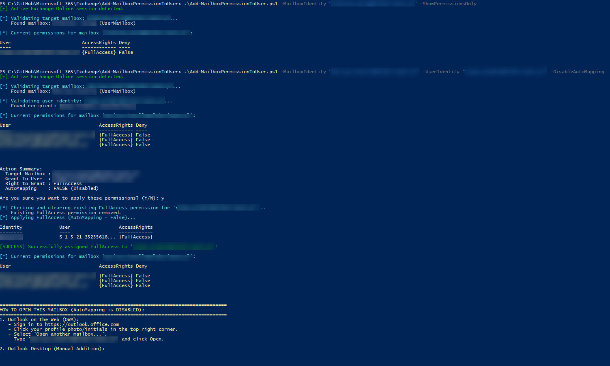

### 3. Zaktualizowany plik `README.md`

```markdown
# Add-MailboxPermissionToUser

A PowerShell automation script for Microsoft 365 Exchange Online administrators to manage mailbox access permissions. It grants `FullAccess` rights to regular or shared mailboxes with granular control over **AutoMapping**, and features an audit mode to view mailbox permissions.

## Features

- **Permission Management**: Assigns `FullAccess` rights to `UserMailbox` and `SharedMailbox` objects.
- **AutoMapping Control**: Optional `-DisableAutoMapping` switch allows you to prevent Outlook Desktop from auto-mounting mailboxes via Autodiscover.
- **Audit Mode**: Use `-ShowPermissionsOnly` to display current explicit permissions without modifying mailbox settings.
- **Identity Pre-Validation**: Verifies that both the target mailbox and the receiving user exist in the Microsoft 365 tenant before prompting for confirmation.
- **Interactive Review**: Displays current non-inherited mailbox permissions and asks for confirmation prior to executing changes.
- **Session Detection**: Checks for active Exchange Online sessions and initiates administrator login when required.

## Prerequisites

- PowerShell 5.1 or PowerShell 7+
- `ExchangeOnlineManagement` module:
  ```powershell
  Install-Module -Name ExchangeOnlineManagement -Scope CurrentUser

```

* Exchange Online administrative role (e.g., Exchange Administrator or Global Administrator).

## Security & Unblocking

When downloading scripts from GitHub, unblock the file before running:

```powershell
Unblock-File -Path .\Add-MailboxPermissionToUser.ps1

```

## Usage Examples

### 1. View Mailbox Permissions Only

```powershell
.\Add-MailboxPermissionToUser.ps1 -MailboxIdentity "sales@domain.com" -ShowPermissionsOnly

```

### 2. Grant Access with AutoMapping Disabled

```powershell
.\Add-MailboxPermissionToUser.ps1 -MailboxIdentity "sales@domain.com" -UserIdentity "admin@domain.com" -DisableAutoMapping

```

### 3. Grant Access with Standard AutoMapping

```powershell
.\Add-MailboxPermissionToUser.ps1 -MailboxIdentity "sales@domain.com" -UserIdentity "admin@domain.com"

```

### 4. Display Help

```powershell
.\Add-MailboxPermissionToUser.ps1 -h

```

---

### 5. Przykłady wywołania skryptu

1. **Podgląd uprawnień (bez żadnych zmian):**
```powershell
.\Add-MailboxPermissionToUser.ps1 -MailboxIdentity "user@elektrimont.pl" -ShowPermissionsOnly

```


2. **Nadanie uprawnień z wyłączeniem AutoMappingu:**
```powershell
.\Add-MailboxPermissionToUser.ps1 -MailboxIdentity "user@elektrimont.pl" -UserIdentity "twoj.login@elektrimont.pl" -DisableAutoMapping

```


3. **Nadanie uprawnień ze standardowym mapowaniem w Outlooku:**
```powershell
.\Add-MailboxPermissionToUser.ps1 -MailboxIdentity "user@elektrimont.pl" -UserIdentity "twoj.login@elektrimont.pl"

```

## Screenshots & Examples

### Info run


### Changing persmission



---

## Author & Contact

* **Author**: Roman Pindela
* **Email**: [roman.pindela@gmail.com](https://www.google.com/search?q=mailto%3Aroman.pindela%40gmail.com)
* **GitHub**: [https://github.com/romanpindela](https://github.com/romanpindela?utm_source=gemini)
* **Version**: 2.0.0

```

