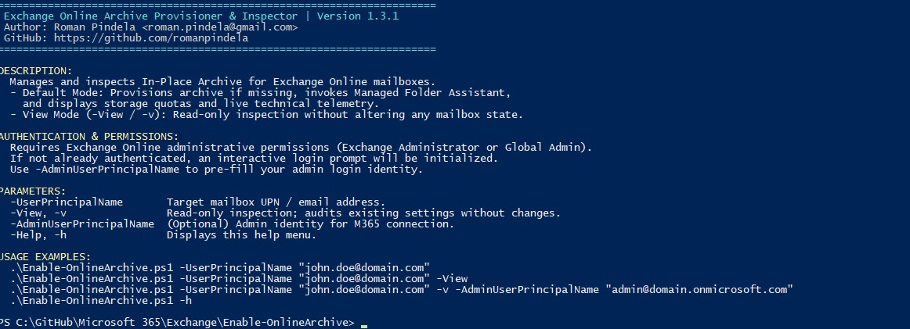
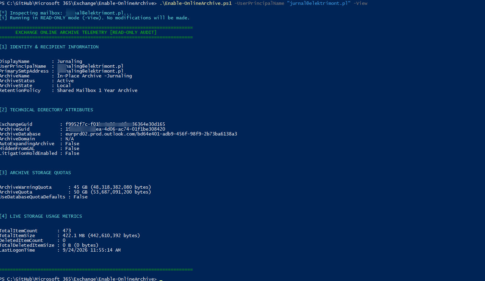

# Exchange Online In-Place Archive Automation

Enterprise-grade PowerShell tool designed to provision, validate, and inspect Microsoft 365 Exchange Online In-Place Archives.

## Features

- **Automated Archive Provisioning**: Checks and activates In-Place Archive for target user accounts.
- **Read-Only Inspection Mode (`-View`, `-v`)**: Audits existing mailbox archive settings, retention policies, GUIDs, and quotas without applying modifications.
- **Immediate Retention Enforcement**: Dispatches the Managed Folder Assistant (`Start-ManagedFolderAssistant`) in provisioning mode.
- **Comprehensive Technical Telemetry**: Gathers storage quotas, live size measurements, mailbox GUIDs, and auto-expansion settings.
- **Cross-Language Windows OS Support**: Built-in Administrator verification operates via Well-Known SIDs, seamlessly supporting Polish, English, and all localized Windows environments.
- **Security & Input Sanitization**: Defends against command misuse using strict RegEx validation and parameter handling.
- **Self-Documenting CLI**: Built-in help display triggered via `-Help` or `-h`.

---

## Important: Unblock File After Download

When downloading scripts from GitHub, the Windows security subsystem tags them with an alternative data stream (`Zone.Identifier`). You must unblock the file before running it:

```powershell
Unblock-File -Path .\Enable-OnlineArchive.ps1

```

---

## Prerequisites

* **PowerShell Version**: Windows PowerShell 5.1 or PowerShell 7.x+.
* **Module**: `ExchangeOnlineManagement` (the script attempts auto-installation if missing).
* **Administrative Rights**:
* Local workstation: Administrator rights (handled by automatic language-independent elevation).
* Microsoft 365: Exchange Administrator or Global Administrator privileges.


---

## Authentication Mechanism

The script uses modern certificate/OAuth authentication through the `ExchangeOnlineManagement` module:

* If an active session is detected, it is reused.
* If not logged in, an interactive Microsoft 365 login screen will launch.
* You can supply `-AdminUserPrincipalName` to automatically target your administrative tenant account.

---

## Usage Examples

### 1. Display Built-In Help Menu

Running the script with no parameters or explicitly calling `-h` prints full guidance:

```powershell
.\Enable-OnlineArchive.ps1 -Help
# or
.\Enable-OnlineArchive.ps1 -h

```

### 2. Read-Only Inspection (Check Current Settings)

Inspect current archive status, quotas, and GUIDs without modifying anything:

```powershell
.\Enable-OnlineArchive.ps1 -UserPrincipalName "john.smith@contoso.com" -View
# or shorthand alias:
.\Enable-OnlineArchive.ps1 -UserPrincipalName "john.smith@contoso.com" -v

```

### 3. Standard Provisioning

Activate and inspect online archive using the default interactive administrator credentials:

```powershell
.\Enable-OnlineArchive.ps1 -UserPrincipalName "john.smith@contoso.com"

```

### 4. Explicit Administrator Credentials Context

Specify your tenant administrator identity prior to execution:

```powershell
.\Enable-OnlineArchive.ps1 -UserPrincipalName "john.smith@contoso.com" -AdminUserPrincipalName "admin@contoso.onmicrosoft.com"

```

---

## Output Telemetry Preview

The script displays four organized diagnostic sections:

1. **Identity & Recipient Information**: Display name, UPN, Archive state, retention policy name.
2. **Technical Directory Attributes**: Exchange GUID, Archive GUID, database allocation, Auto-Expanding Archive status.
3. **Archive Storage Quotas**: Warning and ceiling quotas.
4. **Live Storage Usage Metrics**: Item counts, real-time volume in MB/GB, and recoverable items space.


## Screenshots & Examples

### Standard run


### Getting_info_about_mailbox

---

## Author & Version Information

* **Author**: Roman Pindela
* **Email**: [roman.pindela@gmail.com](https://www.google.com/search?q=mailto%3Aroman.pindela%40gmail.com)
* **GitHub**: [https://github.com/romanpindela](https://github.com/romanpindela?utm_source=gemini)
* **Version**: `1.3.0`

```

