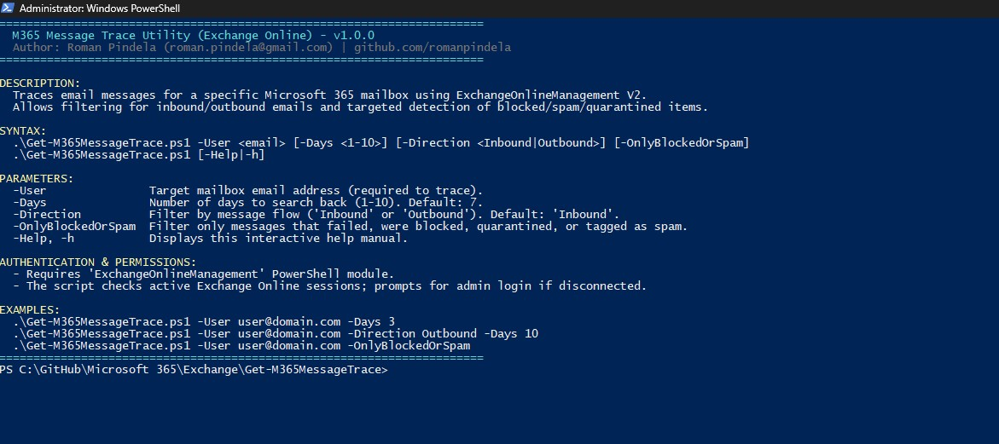
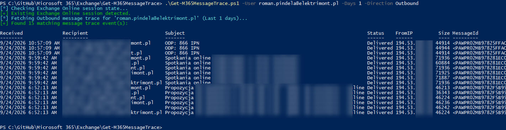
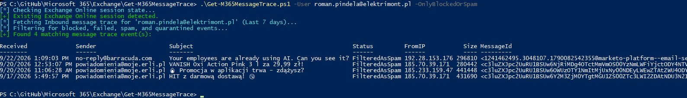
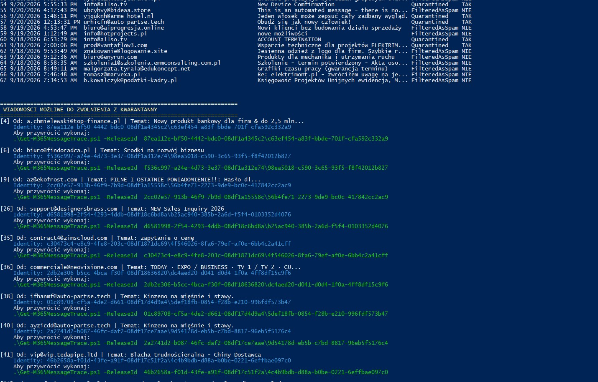

# M365 Message Trace & Quarantine Manager (`Get-M365MessageTrace.ps1`)

A robust, enterprise-grade PowerShell tool designed for Microsoft 365 administrators to inspect email traffic in Exchange Online (via `Get-MessageTraceV2`) and manage Microsoft Defender central quarantine directly from the console.

---

## Author & Metadata

- **Author:** Roman Pindela
- **Email:** [roman.pindela@gmail.com](mailto:roman.pindela@gmail.com)
- **GitHub:** [https://github.com/romanpindela](https://github.com/romanpindela)
- **Version:** `2.0.1`
- **Module Requirements:** `ExchangeOnlineManagement` (v3.0.0 or later)

---

## Features

- **Directional Tracing:** Supports bidirectional message tracking (`Inbound` vs. `Outbound`).
- **Security Auditing:** Filter immediately for rejected, failed, blocked, quarantined, or spam-flagged deliveries using `-OnlyBlockedOrSpam`.
- **Smart Quarantine Correlation:** Automatically cross-references blocked trace events with `Get-QuarantineMessage` to retrieve the unique `QuarantineIdentity`.
- **Direct Quarantine Release:** Release false positives directly to the user's inbox using the `-ReleaseId` parameter.
- **Automatic Session Verification:** Checks for existing Exchange Online sessions and initiates modern administrator authentication when required.

---

## ⚠️ Important: Quarantine vs. Junk Email
This script clearly distinguishes between two types of blocked emails:
1. **Quarantined (`TAK`):** Blocked centrally by Microsoft Defender/EOP. The script will display a `QuarantineId` and generate a ready-to-use command to release it.
2. **FilteredAsSpam (`NIE`):** Delivered to the user's mailbox but moved by local rules to the **Junk Email (Wiadomości-śmieci)** folder. These *cannot* be released via PowerShell cmdlet; the user must mark them as "Not Junk" directly in Outlook/OWA.

---

## Prerequisites & Installation

### 1. Unblock Downloaded Script
If you clone or download this script directly from GitHub, Windows will mark it as untrusted. Unblock it before running:
```powershell
Unblock-File -Path .\Get-M365MessageTrace.ps1

```

### 2. Install Required Module

Make sure the Exchange Online management module is installed on your workstation:

```powershell
Install-Module -Name ExchangeOnlineManagement -Scope CurrentUser -Repository PSGallery -Force

```

---

## Usage Examples

### 1. Display Interactive Help

```powershell
.\Get-M365MessageTrace.ps1 -Help

```

### 2. Inspect Inbound Mail (Default: Last 7 Days)

```powershell
.\Get-M365MessageTrace.ps1 -User "sekretariat@elektrimont.pl"

```

### 3. Check for Blocked, Quarantined, or Spam Messages

```powershell
.\Get-M365MessageTrace.ps1 -User "sekretariat@elektrimont.pl" -Days 10 -OnlyBlockedOrSpam

```

### 4. Release a Message from Quarantine

*You can copy the required `-ReleaseId` directly from the output of the `-OnlyBlockedOrSpam` command.*

```powershell
.\Get-M365MessageTrace.ps1 -ReleaseId "c9e782e4-1111-2222-3333-444455556666\550e8400-e29b-41d4-a716-446655440000"

```

---

## License

This project is licensed under the MIT License - see the LICENSE file for details.

## Screenshots & Examples

### Standard run


### Checking sent messages


### Checking spam messages


### Emails in quarantine


