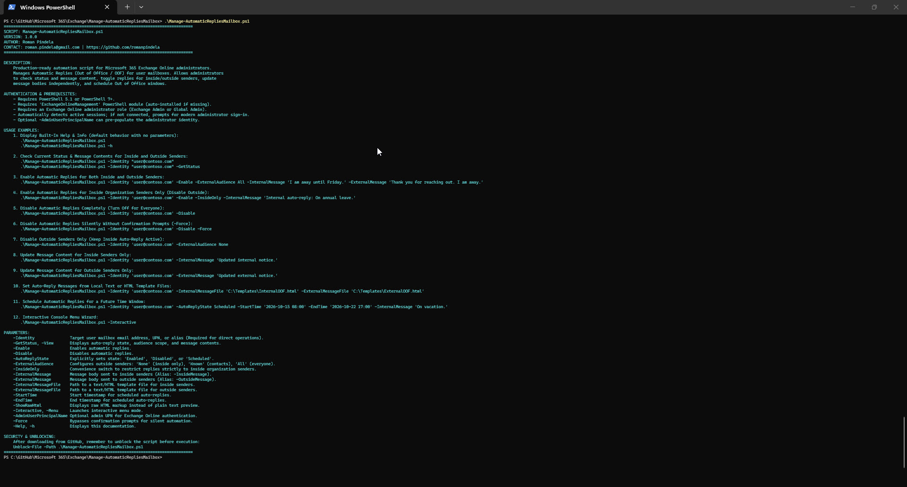
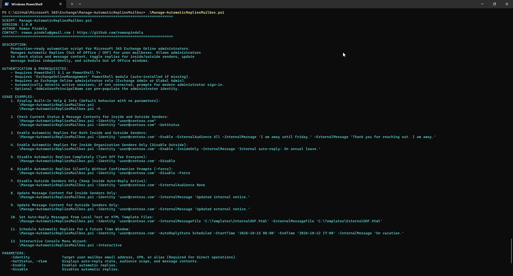
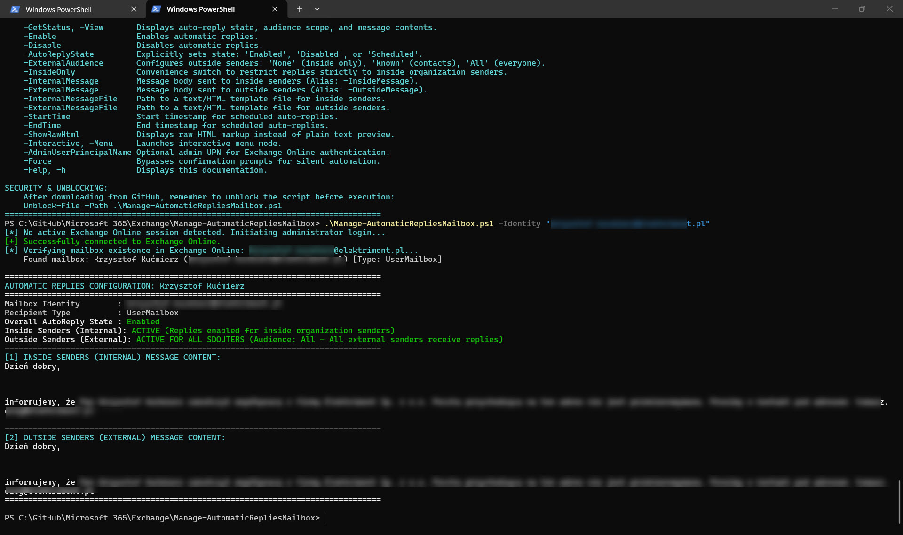
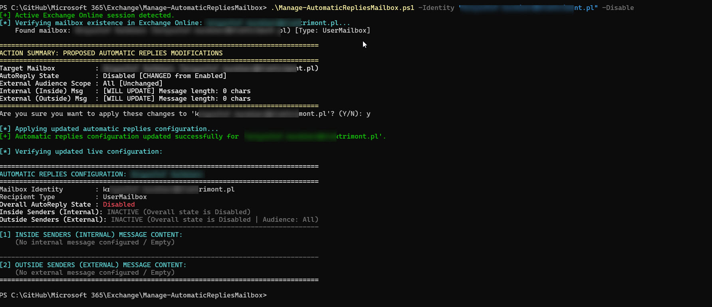
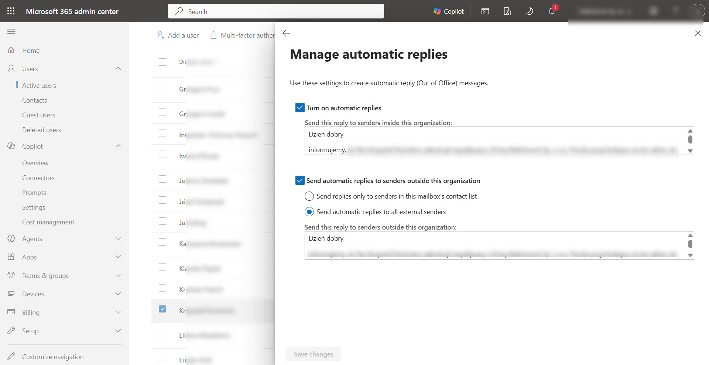

# Manage-AutomaticRepliesMailbox

A production-ready, enterprise-grade PowerShell automation script for Microsoft 365 Exchange Online administrators to manage, inspect, and configure **Automatic Replies (Out of Office / OOF)** on user mailboxes. It allows administrators to **check status and message content**, **toggle auto-replies for inside and outside senders independently**, **customize message bodies** (inline or from template files), **schedule time windows**, and operate via an **interactive console wizard** or unattended scripts.

---

## Features

- **Inspect Status & Messages (Audit Mode)**: Instantly check the live automatic replies state (`Enabled`, `Disabled`, `Scheduled`), see whether inside (internal) and outside (external) replies are active, and preview the configured message bodies directly in the console.
- **Enable & Disable Auto-Replies**: Easily toggle automatic replies on or off globally or per audience.
- **Granular Audience Control (Inside vs. Outside Senders)**:
  - Configure whether external senders receive replies via `-ExternalAudience` (`None`, `Known`, `All`).
  - Use `-InsideOnly` to enable auto-replies exclusively for inside organization senders while disabling external notifications.
- **Independent Message Customization**:
  - Set or update the message body for **inside senders** (`-InternalMessage` / `-InsideMessage`).
  - Set or update the message body for **outside senders** (`-ExternalMessage` / `-OutsideMessage`).
  - Load formatted message text or HTML from local files via `-InternalMessageFile` and `-ExternalMessageFile`.
- **Scheduled Out of Office Windows**: Supports scheduling start and end dates/times (`-StartTime` and `-EndTime`) with automated validation ensuring start precedes end.
- **Interactive Console Wizard**: Launch a menu-driven administrator wizard via `-Interactive` (alias `-Menu`) to guide you through inspection, toggling, message updates, and scheduling.
- **Safety & Input Sanitization**: Pre-execution regex verification for email/UPN addresses, file existence and size limit checks, change summary comparison, and interactive confirmation prompts (`Y/N` or Polish `T/N`) with `-Force` bypass for automated pipelines.
- **Modern Authentication Flow**: Automatically detects existing active Exchange Online sessions; prompts for modern interactive administrator sign-in if disconnected. Supports `-AdminUserPrincipalName` to pre-populate credentials.

---

## Prerequisites

- **PowerShell**: PowerShell 5.1 or PowerShell 7+ (compatible with Windows Desktop and Windows Server, English and Polish editions).
- **Exchange Online Module**: `ExchangeOnlineManagement` (v3.0.0 or later recommended).
  *If missing, the script will automatically attempt to install it for `CurrentUser` from PSGallery.*
  ```powershell
  Install-Module -Name ExchangeOnlineManagement -Scope CurrentUser -Repository PSGallery -Force
  ```
- **Administrative Roles**: An account with the **Exchange Administrator** or **Global Administrator** role in Microsoft 365.

---

## Security & Unblocking

When downloading scripts from GitHub, PowerShell marks files with an execution restriction. Unblock the file before executing:

```powershell
Unblock-File -Path .\Manage-AutomaticRepliesMailbox.ps1
```

---

## Parameter Reference

| Parameter | Type | Description |
| :--- | :--- | :--- |
| `-Identity` | `String` | Target user mailbox email address, User Principal Name (UPN), or alias (Position 0). |
| `-GetStatus`, `-View` | `Switch` | Audits and displays auto-reply status, inside/outside state, and message bodies. (Default action when only `-Identity` is provided). |
| `-Enable` | `Switch` | Enables automatic replies for the specified mailbox. |
| `-Disable` | `Switch` | Disables automatic replies for the specified mailbox. |
| `-AutoReplyState` | `String` | Explicitly sets state: `Enabled`, `Disabled`, or `Scheduled`. |
| `-ExternalAudience` | `String` | Controls outside senders: `None` (inside only), `Known` (contacts only), `All` (all external senders). |
| `-InsideOnly` | `Switch` | Convenience switch to restrict replies strictly to inside organization senders (`ExternalAudience = None`). |
| `-InternalMessage` | `String` | Message content for inside (internal) senders. Alias: `-InsideMessage`. |
| `-ExternalMessage` | `String` | Message content for outside (external) senders. Alias: `-OutsideMessage`. |
| `-InternalMessageFile`| `String` | Local path to text or HTML file containing internal message body. |
| `-ExternalMessageFile`| `String` | Local path to text or HTML file containing external message body. |
| `-StartTime` | `DateTime` | Scheduled start date/time (e.g. `'2026-10-15 08:00'`). |
| `-EndTime` | `DateTime` | Scheduled end date/time (e.g. `'2026-10-22 17:00'`). |
| `-ShowRawHtml` | `Switch` | Displays raw HTML source of messages instead of cleaned plain-text preview. |
| `-Interactive`, `-Menu` | `Switch` | Launches the interactive console wizard. |
| `-AdminUserPrincipalName` | `String` | Administrator UPN to pre-populate the Microsoft 365 login prompt. |
| `-Force` | `Switch` | Suppresses confirmation prompts (`Y/N`) for unattended automated execution. |
| `-Help`, `-h` | `Switch` | Displays built-in help, usage examples, version, and author information. |

---

## Usage Examples

### 1. Display Built-In Help & Info (Default Parameterless Execution)
Running the script without parameters or with `-Help` / `-h` prints full syntax, author details, and examples:

```powershell
.\Manage-AutomaticRepliesMailbox.ps1
# or
.\Manage-AutomaticRepliesMailbox.ps1 -h
```

---

### 2. Inspect Auto-Reply Status & Message Content (Audit Mode)
Retrieve the current state, active audiences, and inspect both internal and external message bodies:

```powershell
.\Manage-AutomaticRepliesMailbox.ps1 -Identity "john.doe@contoso.com"
# or explicitly
.\Manage-AutomaticRepliesMailbox.ps1 -Identity "john.doe@contoso.com" -GetStatus
```

---

### 3. Enable Auto-Replies for Inside & Outside Senders
Turn on automatic replies for everyone with custom message bodies:

```powershell
.\Manage-AutomaticRepliesMailbox.ps1 -Identity "john.doe@contoso.com" -Enable -ExternalAudience All `
    -InternalMessage "I am away from my desk until Friday." `
    -ExternalMessage "Thank you for reaching out. I am currently out of office."
```

---

### 4. Enable Auto-Replies for Inside Organization Senders Only
Enable auto-replies strictly for internal colleagues, blocking automated responses to outside senders:

```powershell
.\Manage-AutomaticRepliesMailbox.ps1 -Identity "john.doe@contoso.com" -Enable -InsideOnly `
    -InternalMessage "I am on annual leave until next Monday. Please contact helpdesk@contoso.com for emergencies."
```

---

### 5. Disable Automatic Replies Completely
Turn off automatic replies for all senders:

```powershell
# Interactive confirmation
.\Manage-AutomaticRepliesMailbox.ps1 -Identity "john.doe@contoso.com" -Disable

# Silent execution (Automation / CI-CD)
.\Manage-AutomaticRepliesMailbox.ps1 -Identity "john.doe@contoso.com" -Disable -Force
```

---

### 6. Disable Outside Senders Only (Keep Inside Active)
Modify the external audience scope so external senders no longer receive replies, while keeping internal auto-replies active:

```powershell
.\Manage-AutomaticRepliesMailbox.ps1 -Identity "john.doe@contoso.com" -ExternalAudience None
```

---

### 7. Update Message Content for Inside Senders Only
Update the internal message body without modifying external settings:

```powershell
.\Manage-AutomaticRepliesMailbox.ps1 -Identity "john.doe@contoso.com" -InternalMessage "Updated: Back in the office on Wednesday."
```

---

### 8. Update Message Content for Outside Senders Only
Update the external message body independently:

```powershell
.\Manage-AutomaticRepliesMailbox.ps1 -Identity "john.doe@contoso.com" -ExternalMessage "Thank you for your inquiry. Our offices are closed for the holiday."
```

---

### 9. Load Messages from Local HTML / Text Template Files
Load comprehensive or branded HTML messages directly from files:

```powershell
.\Manage-AutomaticRepliesMailbox.ps1 -Identity "john.doe@contoso.com" `
    -InternalMessageFile "C:\Templates\InternalOOF.html" `
    -ExternalMessageFile "C:\Templates\ExternalOOF.html"
```

---

### 10. Schedule Automatic Replies Window
Schedule an Out of Office window for a vacation or conference period:

```powershell
.\Manage-AutomaticRepliesMailbox.ps1 -Identity "john.doe@contoso.com" -AutoReplyState Scheduled `
    -StartTime "2026-10-15 08:00" -EndTime "2026-10-22 17:00" `
    -ExternalAudience All `
    -InternalMessage "Attending Tech Summit from Oct 15 to Oct 22." `
    -ExternalMessage "Out of office attending a conference. Replies may be delayed."
```

---

### 11. View Raw HTML Message Source
Inspect unformatted HTML markup stored in Exchange:

```powershell
.\Manage-AutomaticRepliesMailbox.ps1 -Identity "john.doe@contoso.com" -GetStatus -ShowRawHtml
```

---

### 12. Interactive Console Wizard Mode
Launch the guided console menu to manage a mailbox step-by-step:

```powershell
.\Manage-AutomaticRepliesMailbox.ps1 -Interactive
# or
.\Manage-AutomaticRepliesMailbox.ps1 -Menu
```

---

## Screenshots & Output Examples

### Standard Run (Help & Syntax)


### Execution Examples & Parameters


### Displaying User Automatic Reply


### Disabling Automatic Reply


### Outlook on the Web / Microsoft 365 Admin Portal View


---

## Author & Contact

- **Author**: Roman Pindela
- **Email**: [roman.pindela@gmail.com](mailto:roman.pindela@gmail.com)
- **GitHub**: [https://github.com/romanpindela](https://github.com/romanpindela)
- **Version**: 1.0.0

---

## Version History

- **1.0.0** (2026-10-07):
  - Initial release.
  - Automatic detection of active Exchange Online sessions and modern authentication.
  - Comprehensive inspection mode for inside/outside status and message contents.
  - Full toggle support for inside and outside audiences (`ExternalAudience: None, Known, All`).
  - Separate internal and external message body configuration (inline strings and local template files).
  - Scheduling support (`StartTime` / `EndTime`) with validation.
  - Interactive console wizard (`-Interactive` / `-Menu`).
  - Input sanitization, change review summary, and confirmation prompt with `-Force` bypass.
