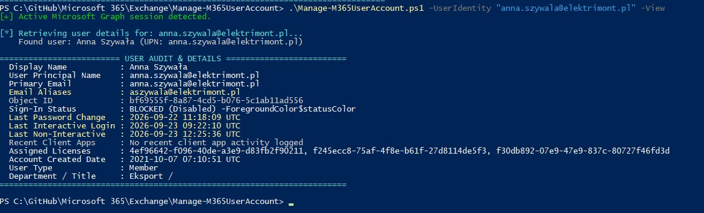

# Manage-M365UserAccount

A production-ready PowerShell management and audit script designed for Microsoft 365 administrators to inspect user activity, toggle sign-in authorization, terminate active sessions, and reset user passwords securely.

## Overview

`Manage-M365UserAccount.ps1` manages user accounts across Microsoft 365 cloud services (Exchange Online, Outlook, Teams, Entra ID). It provides deep account auditing (`-View`), password resets using secure string handling (`[SecureString]`), instant session revocation, and sign-in status management with safety confirmations and automated (`-Force`) execution.

## Features

- **Detailed User Audit (`-View` / `-v`)**:
  - Sign-in status (Blocked vs. Allowed)
  - Last password change date & time (`LastPasswordChangeDateTime`)
  - Last interactive and non-interactive sign-in activity (`SignInActivity`, handled gracefully when missing Entra P1/P2 licenses)
  - Account creation date, assigned license count, and account metadata
- **Instant Session Revocation (`-BlockSignIn` & `-RevokeSessions`)**:
  - Automatically invalidates all active refresh tokens when blocking an account, immediately kicking the user out of Outlook, Teams, OWA, and mobile apps.
  - Can be triggered independently via `-RevokeSessions` without disabling the account.
- **Secure Password Reset (`-ResetPassword`)**:
  - Supports `[System.Security.SecureString]` parameters or interactive masked input (`Read-Host -AsSecureString`).
  - Cryptographically secure 16-character auto-generation using `RandomNumberGenerator`.
  - Passwords never leak to plain-text PowerShell console history (`PSReadLine`) or Script Block Logging.
  - Enforces mandatory password change on the user's next sign-in.
- **Sign-In Control**: Instant block (`-BlockSignIn`) or unblock (`-UnblockSignIn`) of user access across Microsoft 365 services.
- **Safety Checks**: Built-in regex input validation for emails/UPNs, conflicting switch detection, and interactive confirmations.
- **Admin Session Handling**: Automatically detects existing Microsoft Graph sessions or launches a clean interactive sign-in flow.

## Prerequisites

- **PowerShell**: Version 5.1 or PowerShell 7+.
- **Modules**: `Microsoft.Graph.Users` and `Microsoft.Graph.Authentication`
  ```powershell
  Install-Module -Name Microsoft.Graph.Users, Microsoft.Graph.Authentication -Scope CurrentUser

  ```

* **Privileges**: Microsoft 365 Administrator (Global Admin, Privileged Authentication Admin, or User Admin) with consent for `User.ReadWrite.All` and `AuditLog.Read.All`.
> *Note: Reading `SignInActivity` timestamps requires an Entra ID P1 or P2 license in the tenant.*


## Security Notice

When downloading the script from GitHub, PowerShell marks the file as untrusted. Unblock it before running:

```powershell
Unblock-File -Path .\Manage-M365UserAccount.ps1

```

## Usage Examples

### 1. View User Account Audit & Sign-In Info

```powershell
.\Manage-M365UserAccount.ps1 -UserIdentity "alex.wilber@yourtenant.com" -View
# Or with alias:
.\Manage-M365UserAccount.ps1 -UserIdentity "alex.wilber@yourtenant.com" -v

```

### 2. Block User Sign-In

```powershell
.\Manage-M365UserAccount.ps1 -UserIdentity "alex.wilber@yourtenant.com" -BlockSignIn

```

### 3. Unblock User Sign-In (Silent / Automation Mode)

```powershell
.\Manage-M365UserAccount.ps1 -UserIdentity "alex.wilber@yourtenant.com" -UnblockSignIn -Force

```

### 4. Reset Password with Auto-Generated Credential

```powershell
.\Manage-M365UserAccount.ps1 -UserIdentity "alex.wilber@yourtenant.com" -ResetPassword

```

### 5. Reset Password with Custom Plaintext and Block Simultaneously

```powershell
.\Manage-M365UserAccount.ps1 -UserIdentity "alex.wilber@yourtenant.com" -ResetPassword -NewPassword "TempSummer2026!#" -BlockSignIn

```

### 6. Display Built-in Help

```powershell
.\Manage-M365UserAccount.ps1 -Help
# or
.\Manage-M365UserAccount.ps1 -h

```

## Parameters

| Parameter | Type | Required | Description |
| --- | --- | --- | --- |
| `-UserIdentity` | String | Yes | UPN or primary email address of the account. |
| `-View`, `-v` | Switch | No | Displays detailed audit info (last login, password change, licenses, sign-in state) and exits. |
| `-BlockSignIn` | Switch | No | Disables sign-in for the target account. |
| `-UnblockSignIn` | Switch | No | Enables sign-in for the target account. |
| `-ResetPassword` | Switch | No | Generates/sets a new password and enforces change at next login. |
| `-NewPassword` | String | No | Custom password value (used together with `-ResetPassword`). |
| `-Force` | Switch | No | Bypasses interactive confirmation prompts. |
| `-Help`, `-h` | Switch | No | Displays script help and usage examples. |


## Screenshots & Examples

### Standard run


### Info about user


## Author

* **Author**: Roman Pindela
* **Email**: [roman.pindela@gmail.com](https://www.google.com/search?q=mailto%3Aroman.pindela%40gmail.com)
* **GitHub**: [romanpindela](https://github.com/romanpindela?utm_source=gemini)
* **Version**: 1.3.1

