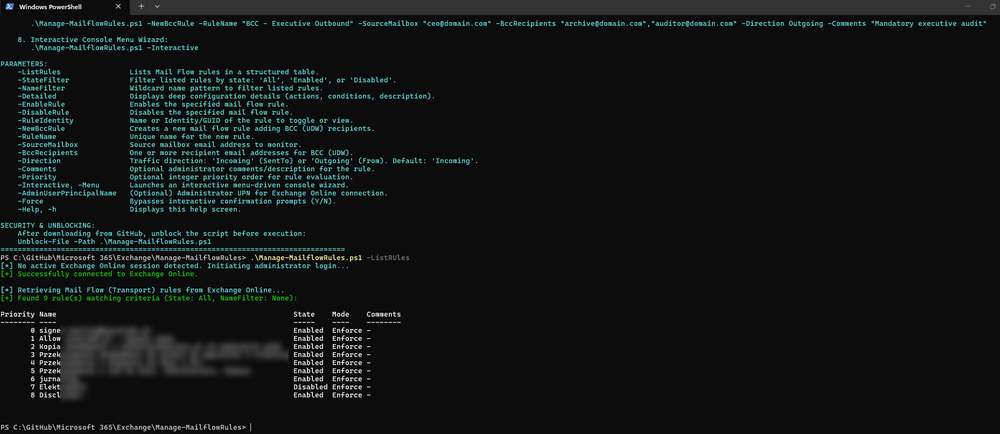
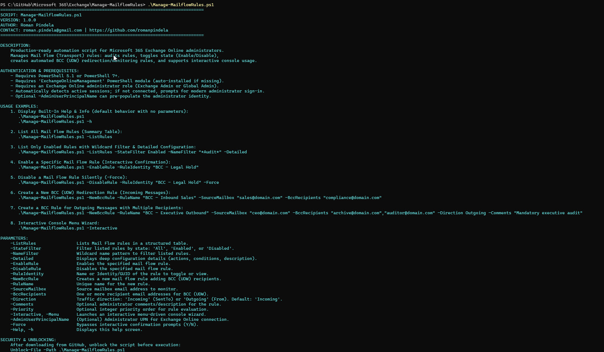
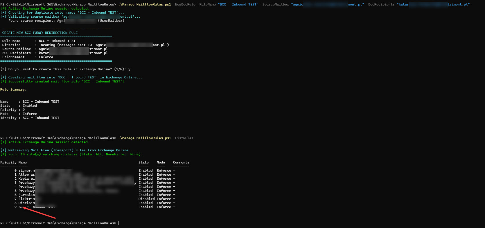
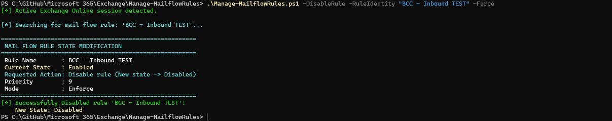

# Manage-MailflowRules

A professional, enterprise-grade PowerShell automation script for Microsoft 365 Exchange Online administrators to inspect, manage, and configure Mail Flow (Transport) rules. It enables administrators to **audit and list rules** in structured tables, **toggle rule states** (Enable or Disable), create **automated BCC redirection/monitoring rules**, and run in an **interactive console wizard** or unattended script.

---

## Features

- **List & Audit Mail Flow Rules**: Displays all tenant transport rules in a clean formatted table including Priority, Name, State (`Enabled` / `Disabled`), Enforcement Mode (`Enforce`, `Audit`, `AuditAndNotify`), and Comments.
- **Detailed Rule Inspection**: Deep-dive audit option (`-Detailed`) exposes rule conditions (`SentTo`, `From`), actions (`BlindCopyTo`), and auto-generated Exchange engine descriptions.
- **Rule State Management**: Safely **enables** or **disables** designated rules with interactive confirmation (`Y/N`) or non-interactive silent execution via `-Force`.
- **Automated BCC Redirection**: Creates transport rules that automatically copy messages to designated BCC recipients (Blind Carbon Copy) for audit, legal hold, or management oversight. Supports both **Incoming** (`-SentTo`) and **Outgoing** (`-From`) message streams.
- **Pre-Execution Input Defense**: Validates email syntax, detects illegal characters, guards against duplicate rule names, and verifies source mailbox existence *before* initiating cloud transactions.
- **Interactive Console Wizard**: Optional `-Interactive` (alias `-Menu`) switch provides a guided, menu-driven interface in the PowerShell console.
- **Modern Authentication Flow**: Automatically detects existing active Exchange Online sessions; prompts for modern interactive administrator sign-in if no active session exists. Supports `-AdminUserPrincipalName` to pre-populate administrative credentials.

---

## Prerequisites

- **PowerShell**: PowerShell 5.1 or PowerShell 7+ (cross-platform on Windows Desktop / Windows Server).
- **Exchange Online Module**: `ExchangeOnlineManagement` (v3.0.0 or later recommended).
  *If missing, the script will automatically attempt to install it for `CurrentUser` from PSGallery.*
  ```powershell
  Install-Module -Name ExchangeOnlineManagement -Scope CurrentUser -Repository PSGallery -Force
  ```
- **Administrative Permissions**: An administrative account assigned the **Exchange Administrator** or **Global Administrator** role in Microsoft 365.

---

## Security & Unblocking

When downloading scripts from GitHub, Windows PowerShell applies an execution restriction flag. Unblock the script before executing:

```powershell
Unblock-File -Path .\Manage-MailflowRules.ps1
```

---

## Usage Examples

### 1. Display Built-In Help & Info (Default Execution)
Executing the script without parameters (or using `-Help` / `-h`) displays detailed help, syntax, author, and usage examples:

```powershell
.\Manage-MailflowRules.ps1
# or
.\Manage-MailflowRules.ps1 -h
```

---

### 2. List All Mail Flow Rules (Summary Table)
Retrieves and displays all tenant transport rules in a prioritized table:

```powershell
.\Manage-MailflowRules.ps1 -ListRules
```

---

### 3. Filter & Audit Rules (State Filter & Detailed Inspection)
Filter rules by state (`Enabled` or `Disabled`), name patterns, and display complete action/condition descriptions:

```powershell
# List only enabled rules matching a wildcard pattern
.\Manage-MailflowRules.ps1 -ListRules -StateFilter Enabled -NameFilter "*BCC*"

# Deep inspection of all rules (including conditions, actions, descriptions)
.\Manage-MailflowRules.ps1 -ListRules -Detailed

# Inspect a single specific rule by Name or GUID
.\Manage-MailflowRules.ps1 -RuleIdentity "BCC - Compliance Monitor"
```

---

### 4. Enable a Mail Flow Rule
Enables an inactive mail flow rule. Displays current state and requests confirmation:

```powershell
# Interactive confirmation
.\Manage-MailflowRules.ps1 -EnableRule -RuleIdentity "BCC - Legal Hold"

# Silent execution (ideal for automation/CI-CD pipelines)
.\Manage-MailflowRules.ps1 -EnableRule -RuleIdentity "BCC - Legal Hold" -Force
```

---

### 5. Disable a Mail Flow Rule
Disables an active mail flow rule:

```powershell
# Interactive confirmation
.\Manage-MailflowRules.ps1 -DisableRule -RuleIdentity "BCC - Legal Hold"

# Silent execution
.\Manage-MailflowRules.ps1 -DisableRule -RuleIdentity "BCC - Legal Hold" -Force
```

---

### 6. Create BCC (UDW) Redirection Rule (Incoming Messages)
Creates a rule that automatically and discreetly adds BCC (UDW) recipients to all messages sent **to** the specified mailbox:

```powershell
.\Manage-MailflowRules.ps1 -NewBccRule `
    -RuleName "BCC - Inbound Sales Monitoring" `
    -SourceMailbox "sales@contoso.com" `
    -BccRecipients "audit@contoso.com" `
    -Comments "Discreet audit copy for incoming sales queries"
```

---

### 7. Create BCC (UDW) Redirection Rule (Outgoing Messages & Multiple Recipients)
Creates a rule copying all messages sent **from** a specific user to multiple compliance mailboxes:

```powershell
.\Manage-MailflowRules.ps1 -NewBccRule `
    -RuleName "BCC - Executive Outbound Audit" `
    -SourceMailbox "director@contoso.com" `
    -BccRecipients "compliance@contoso.com", "archive@contoso.com" `
    -Direction Outgoing `
    -Priority 0 `
    -Comments "Compliance policy - copy outgoing correspondence" `
    -Force
```

---

### 8. Interactive Console Menu Mode
Launches a menu-driven console wizard allowing administrators to list, enable, disable, or create rules interactively:

```powershell
.\Manage-MailflowRules.ps1 -Interactive
# or alias
.\Manage-MailflowRules.ps1 -Menu
```

---

## Parameter Reference

| Parameter | Type | Required | Description |
| :--- | :--- | :--- | :--- |
| `-ListRules` | `Switch` | No | Lists all Mail Flow (Transport) rules in a formatted table. |
| `-StateFilter` | `String` | No | Filters listed rules by state: `All` (default), `Enabled`, `Disabled`. |
| `-NameFilter` | `String` | No | Wildcard pattern to filter rules by name (e.g. `*Sales*`). |
| `-Detailed` | `Switch` | No | Displays detailed configuration (conditions, actions, descriptions). |
| `-EnableRule` | `Switch` | Conditional | Enables the specified mail flow rule. |
| `-DisableRule` | `Switch` | Conditional | Disables the specified mail flow rule. |
| `-RuleIdentity` | `String` | Conditional | The Name, Identity, or GUID of the rule to toggle or inspect. |
| `-NewBccRule` | `Switch` | Conditional | Creates a new transport rule with BCC (UDW) action. |
| `-RuleName` | `String` | Conditional | Unique name for the new mail flow rule (max 64 characters). |
| `-SourceMailbox` | `String` | Conditional | Email address of the target mailbox to monitor. |
| `-BccRecipients` | `String[]` | Conditional | One or more email addresses to receive blind copies. |
| `-Direction` | `String` | No | Message direction: `Incoming` (`-SentTo`, default) or `Outgoing` (`-From`). |
| `-Comments` | `String` | No | Optional administrative description saved with the rule. |
| `-Priority` | `Int32` | No | Priority order for rule evaluation. |
| `-Interactive` / `-Menu` | `Switch` | No | Launches an interactive console menu wizard. |
| `-AdminUserPrincipalName` | `String` | No | Administrator UPN for pre-populating Exchange Online login. |
| `-Force` | `Switch` | No | Bypasses interactive `(Y/N)` confirmation prompts. |
| `-Help` / `-h` | `Switch` | No | Displays built-in help and usage documentation. |

---

## Screenshots & Output Examples

### 1. Standard Execution (Overview)


### 2. Help & Syntax Documentation (`-h` / `-Help`)


### 3. Creating New BCC (UDW) Mail Flow Rule


### 4. Disabling a Mail Flow Rule


---

## Author & Contact

- **Author**: Roman Pindela
- **Email**: [roman.pindela@gmail.com](mailto:roman.pindela@gmail.com)
- **GitHub**: [https://github.com/romanpindela](https://github.com/romanpindela)
- **Version**: 1.0.0

